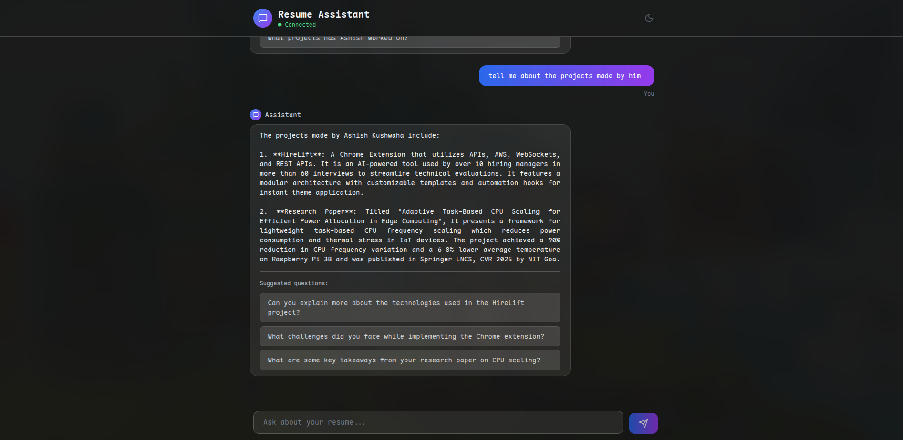

# Resume Chatbot

An AI-powered chatbot that answers questions about your resume using RAG (Retrieval-Augmented Generation) and semantic search.



## Features

- **Natural Language Q&A**: Ask conversational questions about your experience, skills, and projects
- **RAG Architecture**: FAISS vector database with OpenAI embeddings for semantic search
- **Structured Responses**: AI-generated answers with follow-up suggestions
- **Modern UI**: React frontend with dark mode and real-time chat interface
- **Smart Caching**: Resume hash detection to rebuild vector DB only when needed

## Tech Stack

**Frontend**: React + Tailwind CSS + Lucide Icons  
**Backend**: FastAPI + Python  
**AI**: OpenAI (GPT-4o-mini, text-embedding-3-small)  
**Vector DB**: FAISS

## Quick Start

### Backend

```bash
pip install fastapi uvicorn python-dotenv langchain langchain-community langchain-openai faiss-cpu

export OPENAI_API_KEY="your_key"
mkdir -p pdf && cp resume.pdf pdf/

uvicorn main:app --host 0.0.0.0 --port 8000
```

### Frontend

```bash
npm install
npm start
```

## How It Works

1. Resume is parsed and chunked into semantic segments
2. OpenAI embeddings create vector representations
3. FAISS indexes vectors for fast similarity search
4. User questions retrieve top 5 relevant resume sections
5. GPT-4o-mini generates structured answers with follow-ups

## API Endpoints

- `POST /initialize` - Build vector database from resume
- `POST /ask` - Submit question, get structured answer
- `GET /health` - Check system status
